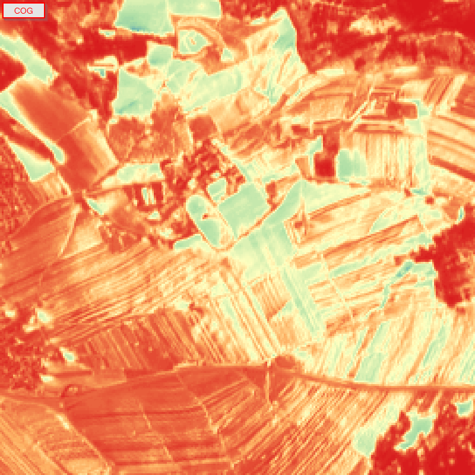

this repo demonstrates the difference between COG and JP2 data, provided by [element84 STAC-API](https://earth-search.aws.element84.com/v1)

Here is an animation of the differences in the B04 band:

use [this](./reproduce.sh) script to reproduce the images.

